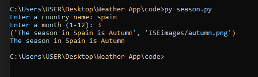

**2. Modularity:** 

Based on scenarios A and B, find the season of the year when a country name and month of the year are given. Finding whether a given temperature reading is above or below the average temperature of a city (morning or evening)

1. **Module 1: get\_season**

Imports: 'country'(string), month (integer)

Exports: result\_text (string), result\_image (string)

Description: This module takes a country name and a month as inputs and determines the corresponding season for the given country and month. It checks the input against a predefined dictionary of countries and their associated seasons. The module returns the season in text format (result\_text) and the file path of the graphical representation of the season (result\_image).

`     `2. **Module 2: get\_average\_temperature**

Imports: city (string),time\_of\_day (string),temperatue\_data(float)

Exports: average\_temperature (float)

Description: This module retrieves the average temperature for a given city from a predefined dictionary of city temperatures. It takes the city name as input and returns the average temperature.

`    `**3. Module 3: compare\_temperature**

Imports: temperature(float),average\_temperature(float) 

Exports: message(string)

Description: This module compares a specific temperature value with the average temperature of the city. If the difference between the temperature and the average temperature is more than 5 degrees Celsius, a message is returned indicating that the temperature is above or below the average. Otherwise, it returns a message that the temperature is within the normal range.

`     `**4. Module 4: display\_output(output)**

`        `Imports: Output(str)

`        `Exports: None

`        `Description: This module displays the output to the user. It takes a string as input and prints it on the screen for the user to see.

`   `All the inputs for these modules are passed as parameters. Inputs for get\_season and get\_average\_temperature are strings and integers, respectively. Outputs for get\_season include the season as a string and the season symbol as a string. Outputs for get\_average\_temperature include the average temperature as a float. The outcome for compare\_temprature is a string message. Output for display\_output is None.

3\. **Modularity:** 

Implementation of the production code, reviewing and refactoring

`                        `**Figure: production code (A)**

`                           `**(Source: created on Vim)**

**Result :** 

**Figure: Season program in action.**

**Figure: Season program return textual and visual outputs.**

`                                 `****

`                              `**Figure: Production code (B)**

`                                `**( Source: created on Vim editor )**

**Result:** 

**Figure: Temperature program in action. Return difference with an average temp.**

**The production code demonstrates the use of good modularity principles. Here's how these principles are applied:**

- **Divide and conquer:**  The code is divided into small functions to handle specific tasks. For example, the ‘get\_season()’ function is responsible for determining the season based on the country and month input. The’get\_average\_temperature()’ function retrieves the average temperature for a given city and time of day from the ‘temperature\_data’ dictionary. The ‘compare\_temperature()’ function compares the input temperature with the average temperature. The ‘display\_output()’ function is responsible for displaying the e output.

- **Encapsulation**: The functionality related to determining the season is encapsulated within the ‘get\_season()’ function, which takes care of processing the input and returning the corresponding season.

- **Maintainabilit**y: The code utilizes meaningful variable names and includes comments to enhance code readability and maintainability.

- **Code complexity reduction:** The code uses dictionaries (‘season\_definitions’ and ‘seasons’) to organize and store season-related information and uses dictionaries ‘temperature\_data’ to store temperature information for different cities and times of the day. This reduces code complexity by providing a clear and structured representation of the data.

- **Coupling:** The modules are loosely coupled as they communicate through function parameters and return values rather than relying on global variables. Control flags are not used in the code. Data is passed explicitly through function parameters.

- **Cohesion:** Each module performs a specific and well-defined task, contributing to the overall functionality of the program. The tasks within each module are related and have a clear purpose.  There is no evidence of poor cohesion or performing unrelated tasks within a module.

- ` `**Redundancy:**  The code avoids redundancy by utilizing functions to encode reusable logic. There are no apparent complications or replications within the code.
- **Code Reuse:** The code separates functionality into different modules, allowing them to be reused independently if needed. The code promotes code reuse by using the ‘season\_definitions’ dictionary to define seasons and reusing it within the ‘get\_season()’ function to determine the season based on the month. Similarly,  the code promotes code reuse by utilizing the ‘temperature\_data’ dictionary in the ‘get\_average\_temprature()’ function to retrieve the average temperature based on the city and time of day inputs.

Here's a short review checklist to evaluate whether good code design principles have been followed:

1. **Modularity:**
- Have you divided your code into smaller, self-contained modules or functions that perform specific tasks?

1. **Encapsulation:**
- Have you encapsulated related functionality within modules, classes , and functions, making them independent and reusable?

1. **Readability:**
- Is your code easy to read and understand? Have you used meaningful variable and function names, and have you added comments when necessary?

1. **Maintainability:**
- Is your code designed to be maintainable? Have you considered code refactoring and ensured that it can be easily modified or extended in the future?

1. **Code Complexity reduction**: 
- Have you minimized code complexity by keeping functions and modules focused on a single task?  
- Are there any unnecessary or redundant code blocks that can be removed?
1. **Coupling and cohesion:** 
- Have you managed the interdependencies between different modules or functions (coupling) to ensure loose coupling and high cohesion? 
- Are there any unnecessary dependencies or tight couplings that can be reduced?
1. **Code Reuse:** 
- Have you promoted code reuse by extracting common functionalities into separate functions or classes that can be used in multiple parts of your codebase?
1. **Performance:**
- **  Have you considered the performance implications of your code design?

**Review Checklist**

- Read all the requirements and understand them well.
- Preliminary design (that must be capable to perform application's goal).
- Identify the need of various modules for an organized and reusable software product.
- Document them all (specify the role of each module).
- Once program structure is ready, it is time to identify branches names for version control.
- It is time to jump into writing code (language of your choice).
- At this stage, you may need version control tool such as git for maintaining application’s version.
- Write White Box and Black Box test cases to see if everything works or behave as intended. 
- If you identify any issues, update your code to fix those issues.
- Finally, deploy the app.

While the production code uses good modularity principles so far I haven’t identified any issues from the generated checklist.

**4. Test Design ( Black box testing )**

1. **Equivalence partitioning method**

**Module 1: ‘get\_season’**

|Category |Test Data|Expected Result|
| :- | :- | :- |
|Valid Input |Country =”Australia”, month =3|
result\_text: “ The season in Australia is Autumn “

|
|Invalid Input|country=” Australia”, month=15|
Result\_text: “None(season not found for the given input)

|
|Valid Input|country=” Spain”,month=7|
result\_text:” The season in Spain is Winter”

|
|Invalid Input|country=”Switzerland”, month =3|result\_text: None(season not found for the given input)|
|Invalid Input|country=”Australia”, month=-3|
Result\_text: None(season not found for the given input)

|

The category is classified into valid inputs and invalid inputs. The valid inputs with country names and month values correspond to valid combinations of country-season mappings. The expected result is the respective season texts for each country-month combination. The invalid inputs have an unrecognized country name and an invalid month value. The expected result is None since the module is expected to handle such cases by returning None. This set of test cases using the equivalence partitioning method helps cover different scenarios and ensures that the module handles both valid and invalid inputs correctly.

**Module 2: “get\_average\_temperature”**

|Category |Test Data|Expected Result|
| :- | :- | :- |
|Valid Input |City =”Perth”, day\_time=”Morning”|
avg\_temp: 18.2

|
|invalid Input |City =”Perth”, day\_time=”Morning”|
avg\_temp: 22.2

|
|invalid Input |
City =”Nepal”, day\_time=”Morning”,

Temperature=”14”
|
Expected\_text:  

Temperature is 5°C above average. It's significantly higher!
|
|invalid Input |
City =”Lahore”, day\_time=”Morning” 

 
|
Expected\_text:  

None
|
|Valid Input |
City =”Nepal”, day\_time=”Morning”,

Temperature=8.4
|expected\_text = "Temperature is within the normal range."|

Here we have categories the results into Valid and Invalid outputs. The inputs to the test case include City name, day\_time, and temperature values. In the above test cases we have tried various combinations. These include; Invalid city name, Invalid temperature reading (compare to average), Invalid comparison to the expected value. On the other hand, valid combination include valid city, day\_time, temperature value etc.

1. **Boundary Value Analysis** 

In the case of boundary value analysis, our aim is to test our app’s module on the edges values also called boundary values. Following are the test cases we have performed to ensure boundaries are correctly incorporated in the program. 

**Module 1: ‘get\_season’**

|Category|Test Data|Expected Value|
| :- | :- | :- |
|Invalid|
Country=”Spain” 

Month = 0
|None|
|Valid|
Country=”Spain”,

Month = 12
|The season in Spain is Summer|
|Invalid|
Country=”Spain” 

Month = 13
|None|

**Module 2: “get\_average\_temperature”**

|Category|Test Data|Actual|Expected Value|
| :- | :- | :-: | :- |
|Invalid|
Country=”Nepal”,

Day\_time = “Morning”,

Temperature = 14
|Average\_temp = 8.5|"Temperature is 5.5°C above average. It's significantly higher!"|
|Valid|
Country=”Nepal”,

Day\_time = “Morning”,

Month = 8.4
|Average\_temp = 8.5|"Temperature is within the normal range."|
|Invalid|
Country=”Nepal”,

Day\_time = “Morning”,

Month = 3.4
|Average\_temp = 8.5|"Temperature is 5.1°C below average. It's significantly lower!"|

**White Box Testing**

White box testing is done to ensure quality and internal structure can both be tested. For demonstration purposes, we run a white box test to make sure the system returns the correct records. We check the size of the season and temperature data in our system i.e. it shouldn't be empty.**  

**Module 1: ‘get\_season’**

|Category|Test Data|Expected Value|
| :- | :- | :- |
|Invalid|
season\_definitions

length > 0
|True|

**Module 2: “get\_average\_temperature”**

|Category|Test Data|Expected Value|
| :- | :- | :- |
|Invalid|Temperature\_data length > 0|True|

